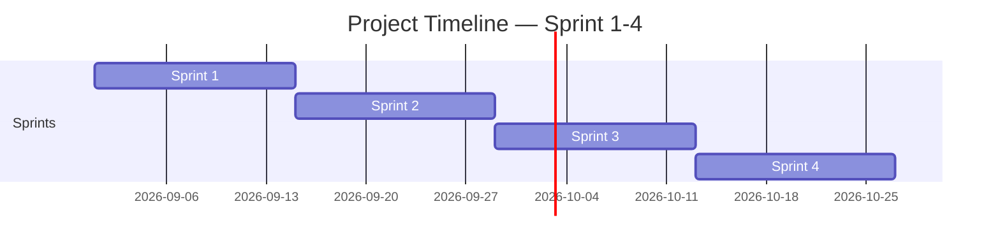

<!-- Template เต็มไฟล์สำหรับสร้าง docs/agile/02-sprint-backlog.md -->
<!-- ภาพรวมว่า Story ไหนไปอยู่ Sprint ไหนตลอด 4 Sprint — ไม่ต้องระบุคนรับผิดชอบ/Status ที่นี่ ส่วนนั้นอยู่ใน sprint-plan-[NN].md ของ Sprint ที่กำลังทำ -->

# Sprint Backlog

**Version:** 1.0 | **Last Updated:** 2026-09-01

> ภาพรวมว่า User Story ไหนจาก `01-product-backlog.md` จะไปอยู่ Sprint ไหน — Sprint ที่ยังไม่ถึงคือ draft คร่าวๆ ปรับได้เสมอเมื่อเข้าใจงานมากขึ้น

## Timeline (4 Sprint, Sprint ละ 2 สัปดาห์)

| Sprint | เริ่ม | สิ้นสุด |
|---|---|---|
| Core Gameplay | 2026-09-01 | 2026-09-14 |
| Assets | 2026-09-15 | 2026-09-28 |
| Content | 2026-09-29 | 2026-10-12 |
| Final Polish | 2026-10-13 | 2026-10-26 |

> ปรับวันที่ให้ตรงกับวันที่ทีมเริ่มลงมือทำจริง (ถ้าไม่ใช่วันแลปนี้)

## Sprint 1 (กำลังทำ)

| # | User Story | MoSCoW | Estimate (SP) |
|---|---|---|---|
| 1 | As a player, I want to enjoy the song and be able to make out what sounds mean what during the game | Must Have | 3 |

## Sprint 2 (Draft)

| # | User Story | MoSCoW | Estimate (SP) |
|---|---|---|---|
| 1 | As an artist, I want there to be sprites and animations to give the game its charm | Must Have | 3 |
| 2 | As a player, I want my inputs to be responsive to the rhythm | Must Have | 3 |

## Sprint 3 (Draft)

| # | User Story | MoSCoW | Estimate (SP) |
|---|---|---|---|
| 1 | As a player, I want to see how the scenery changes the further you play | Should Have | 3 |
| 2 | As a designer, I want there to be distractions during gameplay to add some difficulty | Should Have | 3 |

## Sprint 4 (Draft)

| # | User Story | MoSCoW | Estimate (SP) |
|---|---|---|---|
| 1 | As a player, I'd like to be able to do settings for the calibration | Nice to Have | 3 |
| 2 | As an animator, I'd like to add more animations to the game to make it more alive | Nice to Have | 3 |

> **Sprint 2-4 คือ draft ระดับ release plan** — เป้าหมายคือฝึกกะจำนวน SP ต่อ Sprint ให้ใกล้เคียง capacity ของทีม ไม่ใช่ล็อก scope ตายตัว ปรับได้ทุกครั้งที่ทำ Sprint Planning ของ Sprint ถัดไป
>
> เมื่อ Sprint ไหนเริ่มทำงานจริง ให้คัดลอก template `sprint-plan-template.md` (ไฟล์แนบใน LMS) ไปสร้าง `docs/agile/sprint-plan-[NN].md` แล้วดึง Story ของ Sprint นั้นจากตารางด้านบนมาใส่คนรับผิดชอบ แตก Task และปรับ Estimate ให้ละเอียดขึ้น

## Links
- [[docs/agile/01-product-backlog|Product Backlog]]
- [[docs/agile/sprint-plan-01|Sprint 1 Plan]]
